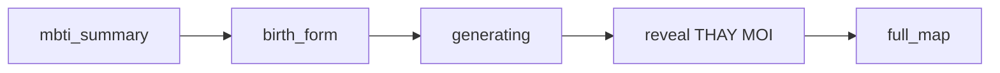

# Plan: Giao diện thông báo 4 Journey đã tạo xong

> **Mục đích:** Tài liệu chi tiết để AI/developer implement màn thông báo sau khi AI tạo xong 4 Journey.
> **Phạm vi:** Thay thế màn `reveal` hiện tại, mock data phase 1.
> **Trạng thái:** Chưa implement (plan)

---

## Bối cảnh

Flow kết quả trong `App.tsx` / `ResultScreen.tsx`:



| Step | Hiện tại | Cần làm |
|------|----------|---------|
| `generating` | Checklist 6 bước, bước 5 "Tạo 4 Journey", timer mock ~7s | Giữ nguyên |
| `reveal` | Headline "SoulMap đã hoàn thành" + Linh Nhi, không list Journey | **Thay bằng UI 4 Journey ready** |
| `full_map` | Bản đồ chi tiết + pillars + chat | Giữ nguyên |

**Quyết định product:**
- Thay thế màn `reveal` — không thêm step mới
- Mock UI phase 1 — chưa gọi API backend

---

## Mục tiêu UX

1. Thông báo rõ: **"4 hành trình của bạn đã sẵn sàng"**
2. Preview 4 Journey: icon, tên, 1 dòng tóm tắt (mock)
3. Linh Nhi chúc mừng + hướng dẫn
4. CTA → `full_map`

---

## 4 Journey

| # | Slug | Title | Icon | Image |
|---|------|-------|------|-------|
| 1 | `identity` | Tôi là ai | User | `/pillars/pillar-self.png` |
| 2 | `career` | Sự nghiệp | Briefcase | `/pillars/pillar-career.png` |
| 3 | `love` | Tình yêu | Heart | `/pillars/pillar-love.png` |
| 4 | `life` | Cuộc đời | Globe | `/pillars/pillar-life.png` |

Tham chiếu: `LandingScreen.tsx`, `docs/core/SOULMAP_TaiLieu_DuAn.md` §8.2–8.5.

---

## Cấu trúc file mới

| File | Mục đích |
|------|----------|
| `soulmap-web/src/types/journey.ts` | Types + interface API future |
| `soulmap-web/src/data/mockJourneys.ts` | `buildMockJourneys(profile)` |
| `soulmap-web/src/components/journey/JourneysReadyStep.tsx` | UI thay block `reveal` |
| `soulmap-web/src/components/journey/JourneyReadyCard.tsx` | Card từng Journey |
| `soulmap-web/src/components/ResultScreen.tsx` | Wire component, xóa reveal cũ |

**Giữ nguyên** `resultStep === 'reveal'` — không đổi type union trong App.

---

## Data model

```typescript
// types/journey.ts
export type JourneySlug = 'identity' | 'career' | 'love' | 'life';

export interface SoulMapJourney {
  id: 1 | 2 | 3 | 4;
  slug: JourneySlug;
  title: string;
  summary: string;
  status: 'ready' | 'generating' | 'locked';
  icon: 'user' | 'briefcase' | 'heart' | 'globe';
  imagePath: string;
}

export interface JourneysGenerationResult {
  journeys: SoulMapJourney[];
  generatedAt: string;
  coreSelfTitle?: string;
}
```

**Mock factory** `buildMockJourneys(profile)`:
- Journey 1 summary ← `profile.pillars.identity`
- Journey 2 ← `profile.pillars.career`
- Journey 3 ← `profile.pillars.love`
- Journey 4 ← `profile.pillars.life`
- Tất cả `status: 'ready'`

---

## Spec UI — JourneysReadyStep

### Layout desktop

```
┌─────────────────────────────────────────────────────────┐
│  ✦  4 HÀNH TRÌNH CỦA BẠN ĐÃ SẴN SÀNG  ✦                │
│  AI đã dệt xong 4 Journey từ MBTI + Tử Vi của bạn       │
├─────────────────────────────────────────────────────────┤
│  [Journey 1]  [Journey 2]                               │
│  [Journey 3]  [Journey 4]          grid 2x2             │
├─────────────────────────────────────────────────────────┤
│  Linh Nhi bubble  │  [ Khám phá Bản Đồ Nội Tâm → ]      │
└─────────────────────────────────────────────────────────┘
```

### Header
- Eyebrow: `HÀNH TRÌNH ĐÃ MỞ KHÓA`
- Title: **"4 Journey của bạn đã sẵn sàng"**
- Subtitle: Linh Nhi đã kết hợp MBTI + Tử Vi...

### JourneyReadyCard
- Badge: `Journey 1` … `Journey 4`
- Icon tròn nền `#EEF3E8`
- Title + summary (max 2 dòng)
- Chip: `✓ Đã tạo xong`
- Hover: translateY + shadow
- Optional: thumbnail pillar mờ góc card

### Linh Nhi
- Bubble: "Chúc mừng lữ hành! Bốn hành trình của bạn đã được dệt xong..."
- Avatar `animate-float`

### CTA
- **"Khám phá Bản Đồ Nội Tâm Chi Tiết"** → `setResultStep('full_map')`
- Style: `#2D4F3E` pill, Sparkles + ArrowRight

### Animation
- Header: `animate-fade-in`
- Cards: stagger delay `100ms * index`
- Linh Nhi: fade-in sau cards

### Mobile
- Grid 1 cột
- CTA full width

---

## Wire vào ResultScreen

Xóa block `reveal` cũ (~dòng 466–513), thay bằng:

```tsx
{resultStep === 'reveal' && (
  <JourneysReadyStep
    profile={profile}
    onExplore={() => setResultStep('full_map')}
  />
)}
```

```typescript
interface JourneysReadyStepProps {
  profile: PersonalityProfile;
  onExplore: () => void;
}
```

---

## API tương lai (không implement phase 1)

```typescript
// hooks/useGenerateJourneys.ts
async function generateJourneys(input: {
  profile: PersonalityProfile;
  birthDate: string;
  birthTime: string;
  gender: string;
}): Promise<JourneysGenerationResult>;
```

Flow sau:
1. `birth_form` submit → gọi API thay timer
2. `generating` → progress streaming/SSE
3. Success → lưu journeys → `reveal`

---

## Checklist implement

- [ ] `types/journey.ts` + `data/mockJourneys.ts`
- [ ] `JourneyReadyCard.tsx`
- [ ] `JourneysReadyStep.tsx`
- [ ] Wire `ResultScreen.tsx`
- [ ] Extract `LINH_NHI_AVATAR` → shared constant (optional)

## Checklist QA

- [ ] Sau `generating` → 4 card đúng tên
- [ ] Summary từ `profile.pillars.*`
- [ ] Badge "Đã tạo xong" rõ ràng
- [ ] Linh Nhi + bubble
- [ ] CTA → `full_map`
- [ ] Responsive + `npm run build`

**Test flow:** Assessment → MBTI → Birth → Generating → Reveal → Full map

---

## Quan hệ với plan MBTI

Plan [MBTI_RESULT_UI_PLAN.md](./MBTI_RESULT_UI_PLAN.md) xử lý `mbti_summary`. Plan này xử lý `reveal`. Hai plan độc lập, có thể implement song song. Nếu conflict: tách `components/mbti/` và `components/journey/`.
