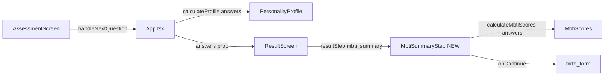

# Plan: Viết lại trang Kết quả MBTI (mbti_summary)

> **Mục đích:** Tài liệu chi tiết để AI/developer implement màn hình kết quả MBTI.
> **Phạm vi:** Refactor từ đầu — tách component riêng, khớp mockup.
> **Trạng thái:** Chưa implement (plan)

---

## Mục tiêu

Sau khi user hoàn thành bài test MBTI trong `soulmap-web/src/components/AssessmentScreen.tsx`, app chuyển sang `currentScreen === 'result'` với `resultStep === 'mbti_summary'`. Màn hình phải khớp mockup (landscape nền mờ, 3 hàng nội dung, card bo tròn, palette xanh rừng + vàng).

**Giữ nguyên** các bước sau (`birth_form`, `generating`, `reveal`, `full_map`) trong `ResultScreen.tsx`.

---

## Luồng dữ liệu



**State trong `App.tsx`:**
- `answers: Record<number, 'A' | 'B'>` — câu trả lời
- `profile: PersonalityProfile` — kết quả MBTI
- `resultStep` — bắt đầu `'mbti_summary'`

**Đã có trong `types.ts`:**
- `calculateProfile(answers)` → `profile.type`
- `calculateMbtiScores(answers)` → `{ introversion, intuition, feeling, judging }` (0–100)
- `PERSONALITY_PROFILES` — mô tả theo type

---

## Cấu trúc file mới

| File | Hành động |
|------|-----------|
| `soulmap-web/src/components/mbti/MbtiSummaryStep.tsx` | Tạo mới — toàn bộ UI `mbti_summary` |
| `soulmap-web/src/components/mbti/mbtiSummaryData.ts` | Tạo mới — label, strengths, copy Linh Nhi |
| `soulmap-web/src/components/mbti/MbtiOverviewCard.tsx` | Tạo mới — card "Tổng quan kết quả" + progress bars |
| `soulmap-web/src/components/ResultScreen.tsx` | Sửa — xóa block inline, import `MbtiSummaryStep` |
| `soulmap-web/src/types.ts` | Giữ `calculateMbtiScores` |

**Props `MbtiSummaryStep`:**
```typescript
interface MbtiSummaryStepProps {
  profile: PersonalityProfile;
  answers: Record<number, 'A' | 'B'>;
  onContinue: () => void; // setResultStep('birth_form')
}
```

---

## Spec UI (desktop ≥1024px)

### Nền
- Base: `#FDFCF5`
- Landscape mờ, gradient kem, sparkle vàng `#B89B5E`
- Navbar giữ trong `ResultScreen`

### Hàng 1 — Grid 12 cột

| Cột | Span | Nội dung |
|-----|------|----------|
| Trái | 3/12 | Linh Nhi + speech bubble |
| Giữa | 5/12 | Kết quả MBTI (type, badge, mô tả ngắn) |
| Phải | 4/12 | Card "Tổng quan kết quả" + 4 progress bars có % |

**Linh Nhi copy:**
- "Tuyệt vời! Linh Nhi đã phân tích xong kết quả MBTI của bạn."
- "Đừng vội rời đi nhé — hãy ấn **Tiếp tục** để nhập thông tin sinh..."

**Cột giữa:**
- Eyebrow: `✦ KẾT QUẢ MBTI CỦA BẠN ✦`
- Type lớn serif: `{profile.type}`
- Badge pill xanh: archetype label (vd. INFJ → "Người lý tưởng hóa")
- Mô tả ngắn ~180 ký tự (không cắt cứng `profile.description` dài)

**Progress bar logic:**
```typescript
const leftPct = scores.introversion; // % phía I
const rightPct = 100 - leftPct;
// Fill theo phía dominant: E/S/T/P → fill từ phải
```

Labels:
- Hướng nội (I) / Hướng ngoại (E)
- Trực giác (N) / Giác quan (S)
- Cảm xúc (F) / Lý trí (T)
- Nguyên tắc (J) / Linh hoạt (P)

### Hàng 2 — Điểm mạnh nổi bật
- Grid 4 cột, icon + title + 1 dòng mô tả
- INFJ mockup: Trực giác tốt, Lòng trắc ẩn sâu, Lý tưởng hóa, Kiên định nội tại

### Hàng 3 — CTA
- "Bước tiếp theo: Khám phá lá số tử vi của bạn"
- Nút **Tiếp tục →** → `birth_form`

---

## Design tokens

| Token | Giá trị |
|-------|---------|
| Primary green | `#2D4F3E` / `#214D3B` |
| Gold | `#B89B5E` / `#B68A2F` |
| Body text | `#5E625F` |
| Border | `#E8DFCF` |
| Sage panel | `#EEF3E8` |

---

## Wire vào ResultScreen

```tsx
{resultStep === 'mbti_summary' && (
  <MbtiSummaryStep
    profile={profile}
    answers={answers}
    onContinue={() => setResultStep('birth_form')}
  />
)}
```

---

## Checklist implement

- [ ] Tạo `mbtiSummaryData.ts`
- [ ] Tạo `MbtiOverviewCard.tsx`
- [ ] Tạo `MbtiSummaryStep.tsx`
- [ ] Wire `ResultScreen.tsx`, xóa code cũ
- [ ] Progress bar fill đúng phía dominant
- [ ] Responsive mobile
- [ ] `npm run build` pass

## Checklist QA

- [ ] Test 10 câu → màn 3 hàng đúng mockup
- [ ] `profile.type` đúng từ answers
- [ ] Linh Nhi nhắc "đừng rời đi" + "ấn Tiếp tục"
- [ ] Nút Tiếp tục → form nhập sinh

---

## Liên quan

- Plan Journey: [JOURNEYS_READY_UI_PLAN.md](./JOURNEYS_READY_UI_PLAN.md)
- Product docs: `docs/core/SOULMAP_TaiLieu_DuAn.md`
